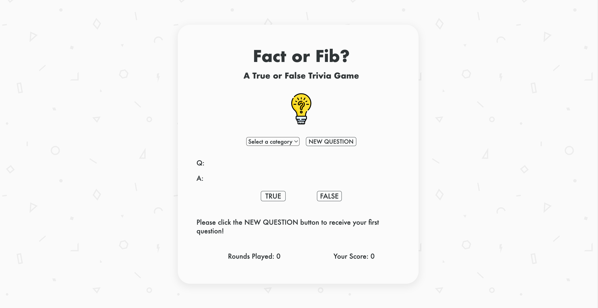
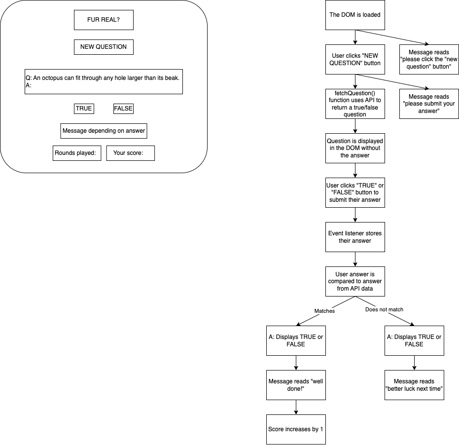
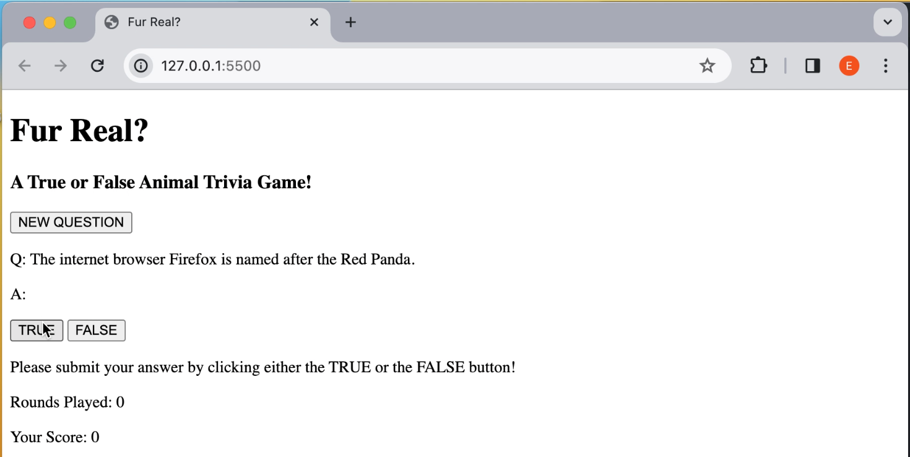

<!-- PROJECT LOGO -->

  

  <h3 align="center">Fact or Fib</h3>

  

    A true or false trivia game.
    

   
<a href="https://erinshien.github.io/factorfib/">View Demo</a>

<!-- TABLE OF CONTENTS -->
   

  
Table of Contents

  <ol>
    <li>
      <a href="#about-the-project">About The Project</a>
      <ul>
        <li><a href="#introduction">Introduction</a></li>
        <li><a href="#built-with">Built With</a></li>
          <li><a href="#my-process">My Process</a></li>
      </ul>
    </li>
    <li><a href="#roadmap">Roadmap</a></li>
    <li><a href="#acknowledgments">Acknowledgments</a></li>
  </ol>

<!-- ABOUT THE PROJECT -->
## About The Project

### Introduction

I love trivia and fun facts, my partner and I even send them to each other when we're apart! I decided to practice what I've learned about using APIs and learn new methods by creating a trivia game. The app connects to the [Open Trivia API](https://opentdb.com/api_config.php) to retrieve each question & answer combination.

### Built With

* 
* 
* 

(<a href="#readme-top">back to top</a>)

### My Process

I planned out the logic of the game in a flow diagram, translated each part of the build into pseudocode and broke this down further into line by line steps, and then worked on creating my async functions, fetching from the API, and updating the DOM with the relevant data.

The app started out as just a simple animal trivia game, but I expanded to include a dropdown menu for the user to select their category. I looked at adding a difficulty selector as well, but found that the API questions didn't provide much variety when the selection was narrowed down that far. I also started with some basic styling, but I would like to push this further and make it more fun and engaging for the user.

(<a href="#readme-top">back to top</a>)

<!-- ROADMAP -->
## Roadmap

- [x] Set Up
    - [x] Boiler plate code
    - [x] Create HTML elements
- [x] Declare variables for the DOM elements that will be manipulated
    - [x] New question
    - [x] Displayed question
    - [x] Displayed answer
    - [x] True button
    - [x] False button
    - [x] Displayed message
    - [x] Rounds played
    - [x] Player score
- [x] Create function that fetches data for 1 true/false question
    - [x] Declare variables for category and difficulty input
    - [x] Declare url variable
    - [x] Declare a variable for the JSON statement that is returned
    - [x] If the promise is unfulfilled return an error message
    - [x] Convert JSON statement to object
- [x] Create function to display question in the DOM
    - [x] Initialise variable for current question
    - [x] Store current question in variable
    - [x] Declare current question variable
    - [x] Display the question in the DOM
    - [x] Include line that changes the message to "please submit your answer"
- [x] Create an event listener that triggers the fetch function when the "new question" button is clicked
- [x] Create function to disable true/false buttons
- [x] Create function to enable true/false buttons
- [x] Create function for if user selects True
    - [x] Check user's answer against correct answer
    - [x] Create event listener for True button
- [x] Create function for if user selects False
    - [x] Check user's answer against correct answer
    - [x] Create event listener for False button
- [x] Create event listeners for default values when DOM is loaded
    - [x] Create an event listener that changes the message to "please click the "new question" button to receive your first question" when the DOM is loaded
- [ ] Stretch Goals
    - [x] Create dropdown to change category
    - [x] Fix HTML entities showing up in some string API responses
    - [ ] Refactor code to stop repetitive lines
    - [ ] Add a delay to disable the New Question button and automatically enable it again after a 5 seconds
    - [ ] Make site responsive to mobile
    - [ ] Change the appearance of the buttons when they are disabled

(<a href="#readme-top">back to top</a>)

<!-- ACKNOWLEDGMENTS -->
## Acknowledgments

* [Icons by Freepik](https://www.freepik.com/)
* [Background Image by Wesley at Toptal](https://www.toptal.com/designers/subtlepatterns/inspiration-geometry/)
* [Open Trivia API](https://opentdb.com/api_config.php)

(<a href="#readme-top">back to top</a>)

